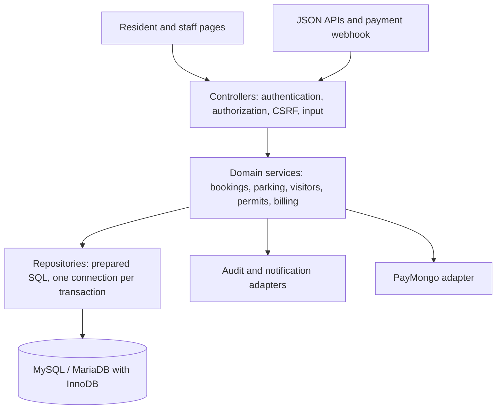

# Condominium system architecture and workflow review

Reviewed 8 October 2026.

## Recommendation

Keep a **modular monolith** on PHP and MySQL/MariaDB, organized by business domain. The existing role dashboards, XAMPP deployment, shared includes, and PayMongo webhook fit one application and one transactional database. A framework migration or separate services would add deployment and authentication work before improving these workflows.

Use this dependency direction as the application evolves:

Target folders for an incremental refactor: `app/Http`, `app/Services`, `app/Repositories`, `app/Policies`, `app/Views`, `database/migrations`, `public`, and `tests`. Keep existing URLs as thin controller entry points during migration. Shared headers and role-aware navigation belong in reusable views.

The release implements the first separation in `includes/environment.php`, `authorization.php`, `authentication.php`, `resident_policy.php`, `resident_navigation.php`, `staff_navigation.php` and `deployment_schema.php`. Domain modules remain in `includes/`; they should be extracted incrementally with existing workflow tests preserved. Moving every page to a framework is not required to establish correct ownership and state transitions.

## Role and ownership policy

`includes/authorization.php` is the capability source of truth. Staff navigation uses the same map as route guards. `isAdmin()` remains a legacy staff classifier and must not grant general management permissions. An unknown capability or unknown role is denied.

| Role | Operational ownership |
| --- | --- |
| Unit owner (`resident` role) | Own requests/documents and owner payment authority. May pay eligible linked occupants' existing bills and order stickers for their approved vehicles. Approved account and unit required. |
| Tenant/authorized occupant (`resident` role) | Own permitted requests, vehicles, documents and messages; owner bills and own existing bills are read-only. Requires approval and an explicit link to the current approved owner of the same unit. |
| Admin | Units/resident records, announcements/messages, bookings/permits, visitor/parking review, vehicle review/sticker issuance, maintenance review/work and violation review/issuance. |
| Superadmin | Management plus account approval, staff management, billing, parking configuration/inventory, audit, analytics and failed-notification review/retry. |
| Treasurer | Billing generation/review and payments; no resident approval, gate operation or vehicle issuance. |
| Security | Visitor registration/parking review and logs, QR gate validation, violation issuance and vehicle registry read access; no dispute waiver/management review, permit review, private OR/CR access or sticker issuance. |
| Maintenance | Work on approved/reopened maintenance requests, start work and record completion; no approval of their own pending work queue. |

Resident ownership is enforced in SQL using the authenticated user ID; an ID from a form/URL is not an ownership claim. Staff review and gate admission are distinct capabilities. Role/activation changes invalidate sessions, and remembered-login tokens are tied to the account's current session version.

`includes/resident_policy.php` distinguishes signup `account_type` from staff roles. Selecting Tenant creates a pending resident account; approval records `unit_owner_id` only against the one active, verified, approved owner of the normalized unit. One owner can have multiple approved occupants. Tenant service settings default to amenities, visitors, visitor parking, vehicles, maintenance and messages enabled, with permits disabled. Family/relative and friend accounts use the same restricted policy. Unknown relationships are denied; legacy blank account types retain owner compatibility and require review.

Tenant bill queries return limited bill/line-item fields, with checkout, provider identifiers, payment controls and receipts excluded. Payment and new sticker-order authority are owner-only rules, independent of tenant settings. Owner sponsorship exposes vehicle selection data without granting access to an occupant's private documents. Ending a selected occupancy revokes that occupant; removing an owner revokes all linked occupants. Financial history remains attached to its original account, with no automatic liability transfer or lease-date filtering. See [TENANT_CONFIGURATION.md](TENANT_CONFIGURATION.md) for configuration and management procedures.

## Findings in the existing code

| Area | Finding | Consequence / recommendation |
| --- | --- | --- |
| Application bootstrap | `config.php` combined configuration, sessions, authentication, schema changes, notifications and business helpers. `connectDb()` invoked role schema updates for each connection. | Configuration/policies/authentication are extracted. Production runtime DDL is disabled and connections require the recorded CLI migration version. Further business-helper extraction remains incremental. |
| Roles | Several pages treated every staff role as management; menus and route guards disagreed. | A shared deny-by-default capability map guards entry points and builds staff menus. |
| Authentication | Recovery tokens, login abuse controls and session invalidation needed consistent boundaries. | Hashed, expiring single-use recovery/verification tokens, login/OTP limits, strict secure session cookies and remembered-token session version checks. Existing unexpired legacy raw-token links need reissuing. |
| Pages | Role folders mix authorization, writes, SQL reads, HTML, and JavaScript. Navigation is repeated. | Move writes into domain services, reads into repositories, and layouts into shared views. |
| Audit | `logAudit()` bound `entity_type` as an integer and the entity ID as a string. | Fixed the parameter types. For stronger guarantees, write audit rows in the same transaction as decisions. |
| Billing and stickers | The resident page created a bill and a sticker claim in separate operations. | New orders now create bill, line item, and claim in one transaction, with a resident row lock to prevent duplicate active orders. |
| Parking | Approvals could omit inventory, and assignment did not check date overlaps. | New approvals require the correct slot type and serialize overlap checks with an inventory row lock. |
| Amenities | Only amenity name and a date comparison were checked. | Enforce real dates, future times, opening hours, guest counts, duplicates, pool capacity, and exclusive hall days. |
| Security scanner | Arbitrary QR content was logged; a matching URL redirected the browser without a database verdict. | Validate recognized application URLs against current approval and dates, then display a verdict and a details link. |
| Visitors and permits | Visitors existed only as staff-created gate logs; permits were absent. | Add resident registrations, management/security review, access passes, and linked gate check-in/checkout. |
| URL generation | `buildUrl()` used the current script directory, making nested-page pass links point at the wrong route. | Derive the application root from the entry script's path. |
| Credentials | Database/SMTP/PayMongo secrets appeared in source or deployment documentation, and the old parking pass signature depended on the database password. | Embedded secrets are removed from current files. Revoke historical credentials and supply new secrets through environment configuration. Parking passes use a dedicated persisted random key or environment secret. |
| Public deployment artifacts | Setup/debug/test code, dependency source, archives and repository metadata were reachable under the document root. | Apache rules deny operational files/directories and private uploads. Read-only HTTP preflight checks confirm denial while public routes/assets still work. |
| Provisioning | The CLI helper accepted passwords in command arguments and silently overwrote matching accounts. | Password input is stdin-only; existing staff updates require an explicit flag and invalidate tokens/sessions. Resident conversion and cross-account username/email collisions are refused. |

## Implemented behavior

* Resident dashboard cards and shared sidebar links use the resident permission policy. Owners see **Visitor Registration**, **Permit Requests**, and **Parking & Stickers**. Tenants see **Unit Bills**, permitted daily services and **Visitor Parking**; permits are hidden and denied by default, and billing is read-only.
* Visitor registrations are for one visit date. Residents may include a vehicle and submit a linked parking request in the same transaction, or select an existing visitor from the parking page. Both pages display linked visitor/parking details. Security or management can approve/reject registrations. Security confirms arrival from the access pass, creating the existing visitor log and linking the registration. Checkout updates both records in one transaction. Duplicate check-in is refused. Rejecting or cancelling a registration cancels its active parking request; parking can also be cancelled independently without cancelling the visit.
* Permit types default to **Move-in, Move-out, Renovation, and Delivery**. Only admin/superadmin roles can approve/reject permits. Residents can cancel their own pending or approved service requests.
* Service pass tokens are random, and viewing requires a logged-in owner or authorized staff account. QR content alone does not admit a visitor; security confirms identity and check-in. Inactive or unapproved residents cannot have their service passes validated.
* Parking configuration at `superadmin/parking_configuration.php` controls sticker price, maximum order quantity, and maximum visitor parking days. Defaults are PHP 1,000, 10 stickers, and 7 inclusive calendar days. New bills snapshot the amount. Earlier bills retain their original totals.
* Resident vehicles are registered at `resident/vehicles.php` with a required OR/CR upload (PDF/JPG/PNG, up to 5 MB) and optional vehicle photo. Admins review registrations at `superadmin/registeredvehicles.php`. Ownership documents are served only to their owner or management through `vehicle_document.php`, with direct Apache access denied.
* Unit owners select approved own or explicitly linked occupants' vehicles for sticker orders: one sticker per vehicle, with quantity derived from the selection. The owner receives and pays the new bill. Billing, claims, and vehicle links are created atomically; allocation and issuance recheck current approved relationships. Admin/superadmin staff issue paid orders, generating a unique internal sticker reference for each vehicle; security cannot issue resident stickers. Historical paid or already-issued orders can be linked to the required number of eligible approved vehicles, preserving earlier issuance timestamps. Paid historical tenant orders can be completed using a valid current owner link without changing their financial records. Vehicles with an existing sticker link cannot receive another order; replacements, expiry, and annual renewals are future policies to define explicitly.
* Visitor parking approvals require an available visitor inventory slot without an overlapping approved reservation. Linked registrations must be approved first. Their cancelled, rejected, pending, or checked-out status cannot authorize a parking pass. Existing unlinked historical parking requests remain readable. Resident assignments use resident slots. Visitor reservations retain their date ranges; they do not permanently mark inventory occupied. The inventory status represents its administrative state, while approved requests show the reservation dates.
* Pool bookings reserve one-hour sessions from 06:00 through 20:00, with at most 20 guests across pending/confirmed bookings. Function Hall reservations are exclusive for a day, up to 100 guests, with arrival times in the same range. Residents can cancel future bookings. Cancelled bookings cannot be reactivated through the review page.
* Changed POST forms and scan submissions use a session CSRF token. Scan verification supports a manual URL entry when a camera is unavailable.
* Resident signup validates a real inventory unit and starts as pending management approval; it does not promise an automatic email-verification signup step. Password recovery and legacy unverified-account re-verification use expiring hashed tokens. Logout confirmation submits a CSRF-protected POST. Role changes and deactivation invalidate active sessions.
* Maintenance follows pending -> management-approved -> in progress -> completed -> resident-confirmed closed. A resident can reopen a completed request or cancel a pending one. Maintenance workers act on approved/reopened requests; management owns approval/rejection. Updates include the expected current status to reject stale actions.

## Transaction and integration boundaries

Visitor registration plus optional parking, linked cancellation/checkout, vehicle sticker ordering and issuance use one connection and transaction for their coupled writes. Parking approvals serialize inventory/date conflicts. Vehicle plate and amenity/day locks prevent competing registrations/reservations on the current single database server. InnoDB and critical unique indexes are validated by the deployment tools, rather than assumed.

The local bill is the financial source of truth; PayMongo is an external settlement adapter. A browser return is not payment proof. Signed callbacks/provider retrieval must match the actual bill and amount, reject invalid/irrelevant events, and handle duplicates without duplicate settlement. Physical sticker issuance remains a separate paid-order decision. Provider credentials, callback delivery and sandbox/live-mode smoke checks are deployment requirements.

Audit records are protected staff-readable accountability data. Payment settlement, bills, fine decisions, sticker issuance and staff creation write their audit row on the business transaction connection. Remaining legacy calls log after commit and report logging failures privately without presenting a committed action as failed.

Operational email/SMS notices use `notification_outbox`. Payment receipts are queued in the settlement transaction; duplicate events do not create extra jobs. The CLI worker claims bounded batches, retries failed delivery up to five times with backoff, and cancels obsolete notices before contacting a provider. Account approval/rejection notices are tied to the decision's committed session version and current status. Superadmin can inspect and audit failed-delivery retries. Delivery is at least once: a crash after provider acceptance can cause a retry. Security codes and password recovery mail are sent immediately through their rate-limited authentication paths.

## Data and rollout

New module storage includes `resident_service_requests`, `parking_policy`, `access_signing_keys`, `parking_sticker_vehicles`, `authentication_limits` and the scanner log. The vehicle module supports the existing `vehicles` schema and creates it on fresh installs. Bookings gain `attendees` with a default of 1 for historical bookings. Parking requests gain a nullable indexed `visitor_registration_id`; historical requests remain unlinked. Authentication adds expiry/abuse counters and remembered-session versions.

Users gain an indexed nullable `unit_owner_id`. Explicit CLI migration links existing approved tenants/occupants only to an unambiguous active, verified, approved owner of their normalized unit. Existing bills retain their original user IDs and totals. Review ambiguous links, legacy blank account types and unresolved invoices before ending or reassigning occupancy.

`php scripts/migrate.php --apply` runs the idempotent schema functions under an advisory lock and records `2026.10.08.2` in `app_schema_versions` only after validating schema and transactional storage. Production web requests do not run these schema functions. `php scripts/preflight.php --production --http=<HTTPS app URL>` is read-only and checks configuration, schema, runtime prerequisites and HTTP artifact denial. See [DEPLOYMENT.md](DEPLOYMENT.md) for staging, backup, migration, credential handling, smoke checks and rollback.

1. Back up the database before deploying the update. The current relevant tables were inspected and all use InnoDB. Transactions require a transactional engine; see the [PHP transaction documentation](https://www.php.net/manual/en/mysqli.begin-transaction.php).
2. Apply the explicit CLI migration with temporary schema privileges, then use the restricted runtime account and production configuration. Do not manually insert a release marker or rely on opening pages to upgrade production storage. Open parking configuration as superadmin to set the policy.
3. Ensure visitor inventory is present and its slots have `slot_type = 'visitor'`. Review old overlapping bookings/reservations before operational use. Historical attendee counts are unknown and migrate as 1; verify actual group sizes where future bookings already exist.
4. Existing downloaded parking QR codes must be regenerated from the resident parking page because the signing key changed. The new key persists in the database. An optional `CONDO_PASS_SIGNING_KEY` must be a strong random secret shared by all application instances; rotating it invalidates earlier parking QR codes.
5. Confirm permit categories and operating hours against the property's actual policies. The four permit types and current booking rules are initial application defaults, not a claim about building regulations.
6. Review existing vehicle registrations in `superadmin/registeredvehicles.php`. In Parking & Stickers, link any historical paid/issued sticker orders to approved vehicles before further issuance. The generated CS reference is an internal tracking number; reconcile it with the property's physical sticker inventory. Check one complete resident → review → pass → gate workflow with staff. Camera and hosted payment provider interactions need browser/device and sandbox-provider checks.

## Follow-up architecture work

Continue extracting shared page layouts and each domain's writes into services that accept a database connection. Move sticker order persistence out of `includes/paymongo.php` so the gateway adapter owns only provider interactions. The current CLI upgrade reuses idempotent legacy schema functions; future releases should add discrete versioned migration steps and retain prior versions instead of repeatedly editing historical migration behavior.

Extend transaction-aware audit logging to remaining legacy decisions. Keep CSRF and capability protection on every new browser mutation and use consistent HTTP errors for JSON APIs. Move private uploads completely outside the public document root where hosting supports it; preserve the existing authorized file endpoints.

Before scaling to multiple properties, add an explicit property ID to units, inventory, requests, and authorization checks. Do not infer tenant isolation from a resident's unit text. Monitor slow queries and add indexes based on actual request patterns. The mutex for amenity/day booking currently depends on one database server; replace it with inventory/session rows and transactional row locks if bookings become a high-volume or multi-database workload.

## Verification

Run `php scripts/test_resident_workflows.php`. It creates a uniquely named disposable database and removes it in `finally`; it does not add fixture accounts or requests to the existing condo database. It checks workflow authorization, pass validation, date limits, billing rollback under an injected claim failure, duplicate issuance/check-in, parking conflicts, booking capacity, rendered page output, CSRF fields, and rendered JavaScript syntax. It requires database create/drop privileges, PHP mysqli/DOM, and Node.js for JavaScript syntax checks.

The CLI fixture renderer is inaccessible over HTTP. PHP syntax checks cover the modified application areas. Automated checks do not exercise camera hardware, browser appearance, or live PayMongo callbacks.

`php scripts/test_tenant_policy.php` checks signup/approval identity, explicit owner links, configurable daily-service restrictions, private-data isolation, occupancy removal and rendered controls. `php scripts/test_tenant_billing.php` checks read-only tenant bills, owner-only payment attempts, owner-sponsored vehicle stickers, stale relationships and unchanged legacy financial records. These tests use disposable databases and no provider calls.

`php scripts/test_deployment.php` validates a fresh baseline migration and repeat upgrade, required unique indexes, rejection of non-InnoDB storage without automatic conversion, release marking, safe CLI staff provisioning and production readiness failure when required settings are absent. All fixtures are in a uniquely named disposable database. Local HTTP checks verified forbidden artifact URLs return 403, while the entry point and public stylesheet remain accessible. Production deployment still requires newly configured secrets, a compatible host and the operational smoke checks in the deployment guide.
